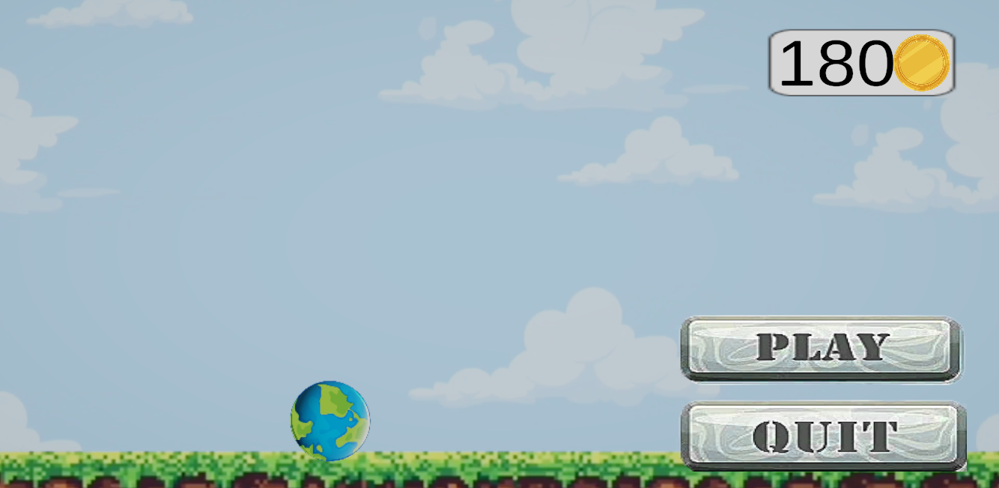

# 2D-Platformer-Game
A 2D platformer game developed using Unity and C#. Game features:- player movement, coin collection, multiple levels with increasing difficulty, and a simple UI system including menu and level completion screens.

## 🎮 Gameplay Screenshot

## 🏠 Main Menu

## 🏁 Level Complete

