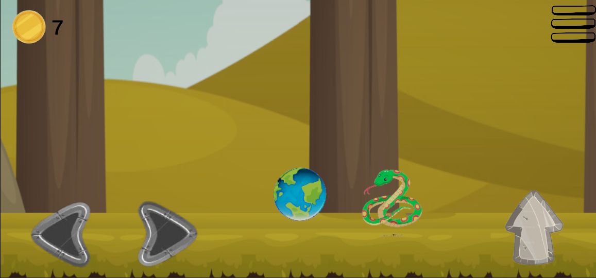
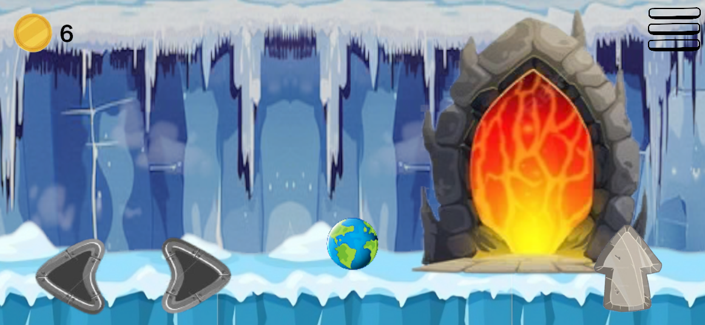

# 🎮 2D Platformer Game

## 📖 About The Game
This is a 2D platformer game developed using Unity and C#.  
In this game the player collects coins, avoids enemies and reaches the portal to complete the level.  
The game includes multiple levels with increasing difficulty, enemy obstacles and a level completion system.

---

## ✨ Features
- 🪙 Coin Collection System
- 👾 Enemy AI
- 🌍 Multiple Levels
- 🌀 Portal System
- ⏸️ Pause Menu

---

## 🖼️ Game Screenshots

### 🏠 Main Menu

### 🎮 Gameplay

### 🏁 Level Complete Screen

---

## 🛠️ Built With
- Unity Engine
- C#
- Visual Studio
